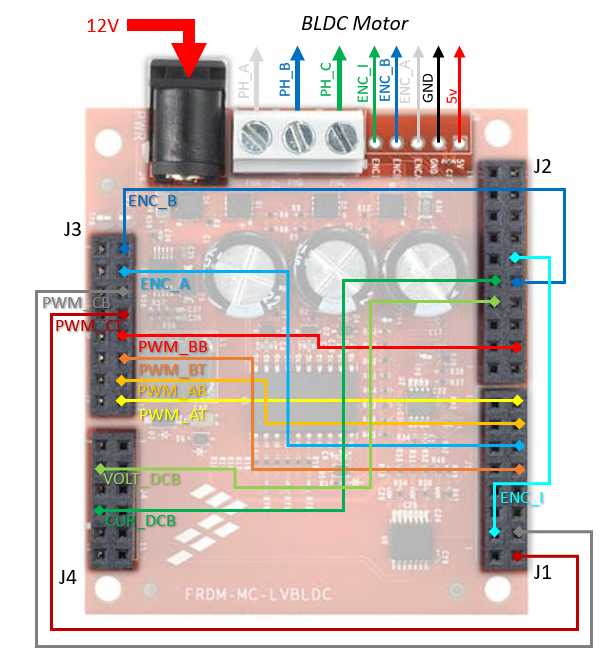
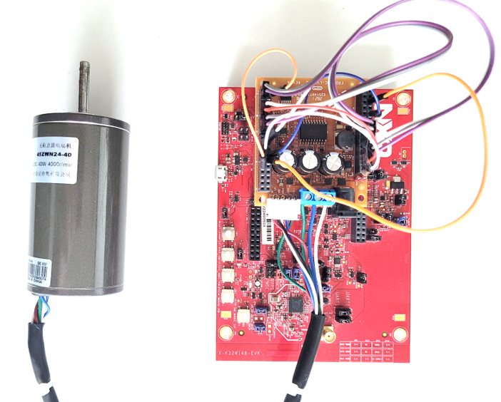
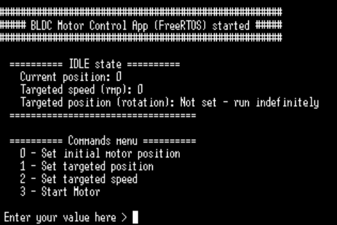
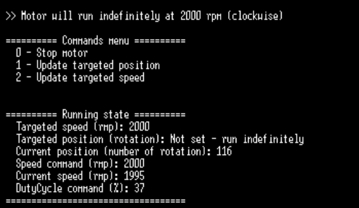
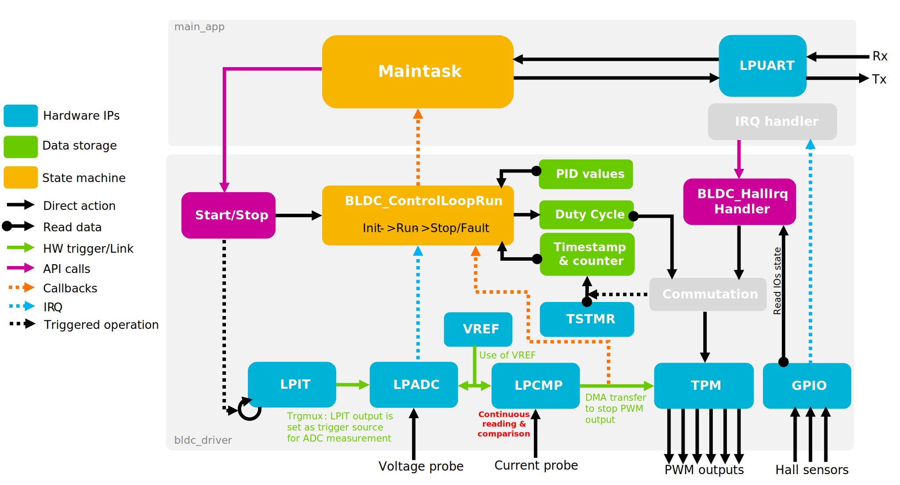
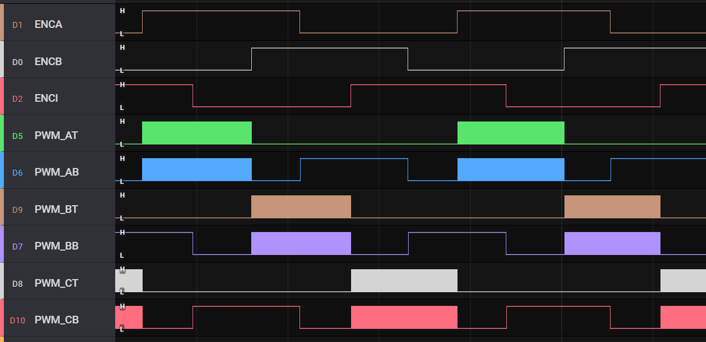
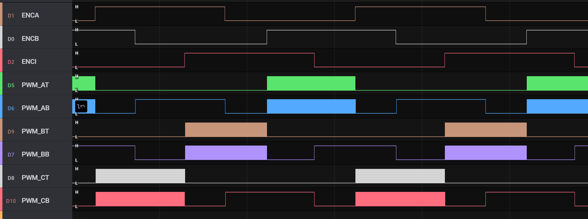
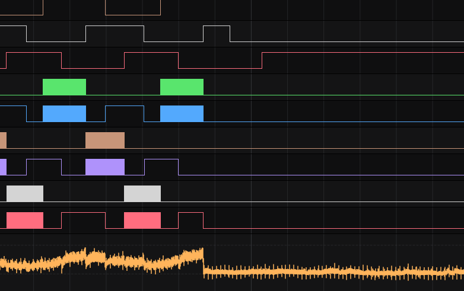

# NXP Application Code Hub

## K32W148 BLDC Motor control FreeRTOS application

This software shows how to control a Brushless DC (BLDC) Motor with K32W148. 
It offers an easy-to-use and portable driver to initialize and use the needed peripherals to control a BLDC motor with Hall sensors. It implements two PID control loops to monitor the speed and the position (number of rotations), as well as a Current protection mechanism (Hardware comparator) and Voltage protection mechanism (ADC). The usage of this driver is showcased in a simple FreeRTOS demo application.

#### Boards: K32W148-EVK, KW45B41Z-EVK
#### Categories: Motor Control, RTOS
#### Peripherals: ADC, GPIO, PWM
#### Toolchains: MCUXpresso IDE

## Table of Contents
1. [Software](#step1)
2. [Hardware](#step2)
3. [Setup](#step3)
4. [Results](#step4)
5. [Flow](#step5)
6. [FAQs](#step6) 
7. [Support](#step7)
8. [Release Notes](#step8)

## 1. Software
To build and run this demo, you will need :
- [MCUXpresso IDE](https://www.nxp.com/design/design-center/software/development-software/mcuxpresso-software-and-tools-/mcuxpresso-integrated-development-environment-ide:MCUXpresso-IDE) 11.8.0 or newer.
- [K32W148-EVK SDK](https://mcuxpresso.nxp.com/en/welcome) version 2.12.7
- Serial console tool (e.g. Tera Term or PuTTY)

## 2. Hardware
This demo requires :
- One [K32W148-EVK board](https://www.nxp.com/design/design-center/software/development-software/mcuxpresso-software-and-tools-/k32w148-evaluation-kit-with-multiprotocol-radio:K32W148-EVK) or a [KW45B41Z-EVK](https://www.nxp.com/design/design-center/software/development-software/mcuxpresso-software-and-tools-/kw45b41z-evaluation-kit-with-bluetooth-low-energy:KW45B41Z-EVK) with a micro-USB cable
- One [FRDM-MC-LVBLDC](https://www.nxp.com/design/design-center/development-boards-and-designs/general-purpose-mcus/nxp-freedom-development-platform-for-low-voltage-3-phase-bldc-motor-control:FRDM-MC-LVBLDC) (Freedom Development Platform for Low-Voltage, 3-Phase BLDC Motor Control)
- One [FRDM-MC-LVMTR](https://www.nxp.com/design/design-center/development-boards-and-designs/general-purpose-mcus/low-voltage-3-phase-motor-for-frdm-platform:FRDM-MC-LVMTR) (3-Phase Brushless DC motor - Linix 45ZWN24-40 Motor)
- One 12V DC power supply (Output current between 2A and 5A)

## 3. Setup
### 3.1 Step 1 - Download and Install Required Software(s)
If not already done:
- Install [MCUXpresso IDE](https://www.nxp.com/design/design-center/software/development-software/mcuxpresso-software-and-tools-/mcuxpresso-integrated-development-environment-ide:MCUXpresso-IDE) 11.8.0 or newer
- Install  [K32W148-EVK SDK](https://mcuxpresso.nxp.com/en/welcome) version 2.12.7.
- Install any Serial Console application (e.g. Tera Term or PuTTY)

### 3.2 Step 2 - Open, Build, and Flash Example
First, connect the K32W148-EVK to the PC using a micro-USB cable.
Then, from MCUXpresso:
1. Go to "Quickstart Panel" and click on "Import Project(s) from file system"
2. Select "Project directory (unpacked)" and browse to the cloned project folder.
3. Select the imported project and press the build button
4. Use the "GUI Flash Tool" button to flash the image. If your board is correctly connected, it should appear in the "Available attached probes" pop-up window. Select it, and finalize  the flashing. 

### 3.3 Step 3 - Boards connection
Then, connect the FRDM-MC-LVBDLC to the K32W148 and the motor as specified here:

|    PIN NAME    |  FRDM-MC-LVBLDC  |    K32W148-EVK    |      K32W148-EVK PIN NAME    |
|----------------|------------------|-------------------|------------------------------|
|     PWM_AT     |    J3, pin 15    |     J1, pin 8     |   PTA21 (TPM0_CH0)           |
|     PWM_AB     |    J3, pin 13    |     J1, pin 7     |   PTA20 (TPM0_CH1)           |
|     PWM_BT     |    J3, pin 11    |     J1, pin 4     |   PTA19 (TPM0_CH2)           |
|     PWM_BB     |    J3, pin 9     |     J2, pin 2     |   PTA18 (TPM0_CH3)           |
|     PWM_CT     |    J3, pin 7     |     J1, pin 1     |   PTA16 (TPM0_CH4)           |
|     PWM_CB     |    J3, pin 5     |     J1, pin 2     |   PTA17 (TPM0_CH5)           |
|     ENC_A      |    J3, pin 3     |     J1, pin 6     |   PTB0  (PTB0_GPIO)          |
|     ENC_B      |    J3, pin 1     |     J2, pin 5     |   PTB1  (PTB1_GPIO)          |
|     ENC_I      |    J1, pin 3     |     J2, pin 6     |   PTB2  (PTB2_GPIO)          |
|     VOLT_DCB   |    J2, pin 7     |     J4, pin 2     |   PTD2  (ADC0_A6)            |
|     CUR_DCB    |    J2, pin 9     |     J4, pin 4     |   PTA4  (CMP0_IN0/BOOT_CFG)  |
|     GND        |    J3, pin 12/14 |     J3, pin 7/6   |   GND                        |
|     3V3        |    J3, pin 4/8   |     J3, pin 2/4   |   VBOARD                     |

|    PIN NAME    |  FRDM-MC-LVBLDC  |  MOTOR WIRE   |
|----------------|------------------|---------------|
|  Phase_A (PHA) |    J7, pin 1     | White (thick) |
|  Phase_B (PHB) |    J7, pin 2     | Blue (thick)  |
|  Phase_C (PHI) |    J7, pin 3     | Green (thick) |
|  Hall_1 (ENCA) |    J8, pin 5     | White (thin)  |
|  Hall_2 (ENCB) |    J8, pin 4     | Blue (thin)   |
|  Hall_3 (ENCI) |    J8, pin 3     | Green (thin)  |
|  GND           |    J8, pin 2     | black (thin)  |
|  5V            |    J8, pin 1     | red (thin)    |

**Then connect the 12V power supply to the PWR connector (J6).**

An easy way to connect is to plug the FRDM-MC-LVDLDC shield on top of the K32W148-EVK on the Arduino header and use wires as shown in the below picture. (In that case, GND, and 3V3 are automatically connected to the correct pin on EVK)

## 4. Run the example
Open your Serial console, and select the corresponding port COM with the following configuration:
- Speed: 115200
- Data: 8 bits
- Parity: None
- Stop bits: 1 bit
- Flow Control: None

Then, press the reset button (RST_SW) on the K32W148-EVK. You should have the following message printed on the console:

Here is a brief description of all possible commands:

- **0. Set initial motor position**: Set the current position. By default, the initial position is 0 at reset. **Motor must be stopped to access this command**.
- **1. Set targeted position**: Set the position (number of rotations) the motor should reach. If the selected position is greater than the current position, the motor will turn clockwise to reach the target. Else, it will turn counterclockwise. In both cases, the absolute value of the "targeted speed" will be used as a maximum speed. **Can be updated at run time**.
- **2. Set targeted speed**: Set the speed of the motor (in rotation per minute). If a targeted position is set, the driver will use this value as a maximum speed. Otherwise, the motor will run indefinitely at the selected speed. If 0 (default value), the motor will not start. A positive value means clockwise rotation and a negative value means counterclockwise rotation. **Can be updated at run time**.
- **3. Start Motor**: Start the motor

To interact with the application, simply use the corresponding number on the keyboard. The printed information will be updated according to the selected command. When the motor is running, some information about the current state is printed and updated every 100ms as shown below:

## 5. Flow
The application and bldc driver can be summarized with this diagram: 

You can connect a Logic analyzer on the different signals to see the commutation correlated to the hall output. 
- In clockwise mode, you should observe the following pattern:

- In counterclockwise, you should observe the following:

- If the current exceeds the threshold programmed in the lowpower comparator, PWM will be stopped automatically:

## 6. FAQs
1. After resetting, nothing is printed on the console:
    - Check your micro-USB cable
    - The device may be in ISP mode because the current probe is connected to the PTA4 pin (CMP0_IN0/BOOT_CFG). In that case, you need to disconnect this pin before resetting the device.

2. The motor is not starting and the "current overshoot" error message is printed:
    - Tune the motorCfg.busCurrentMax and/or driverCfg value(s) (e.g. busCurrentScaleFactor) in MainApp_InitMotor() function. 
    - Sometimes the motor can be in the wrong configuration and it is not able to start correctly as it requires too much current. Try to stop it and move the rotor manually before retrying.

3. Targeted position is not perfectly reached:
    - It is normally to have a few rotations of difference between the targeted position and the real position. You can tune the PID values in MainApp_InitMotor() to improve.

4. How to integrate the motor driver into another application:
    - The motor driver (under source/bldc_driver folder) has been designed as generic as possible to ease the portability. It only requires the upper application to:
        - Import the needed peripheral drivers : **fsl_edma, fsl_lpadc, fsl_lpcmp, fsl_lpit, fsl_tpm, fsl_trgmux, fsl_vref, fsl_tstmr**
        - Defines :
            - The GPIO IRQ handler and call the **BLDC_HallIrqHandler()** API.
            - The callback function to receive events from the driver (see bldcEvtCallbackHandler()).
        - Uses:
            - **BLDC_Init()** API to initialize the driver, providing the motor and hardware characteristics, as well as the previously defined callback function (see MainApp_InitMotor()).
            - **BLDC_SetupPIDs()** API to setup the PIDs (see MainApp_InitMotor()).
            - **BLDC_SetInitPos()** API to set the initial position.
            - **BLDC_Start()** API to start the motor, providing the targeted position and speed.
            - **BLDC_Stop()** API to stop the motor.
        - Optionally uses:
            - **BLDC_UpdateRpmCmd()** API to update the speed command at any time.
            - **BLDC_UpdatePosCmd()** API to update the position command at any time.
            - **BLDC_GetSectorCount()** API to get the current position (unit is 1/6 of a full rotation) at any time.
            - **BLDC_GetSpeed()** API to get the current speed (in rpm) at any time.
            - **BLDC_GetPidInfo()** API to get the PIDs outputs (duty cycle & speed command) at any time.

5. Porting on KW45B41Z-EVK
    - KW45 is pin-to-pin compatible with K32W, so no modification in the software is needed. However, because KW45-EVK as a LIN transceiver connected to PTA16 (used as PWM output in the code), resistor R172 must be removed from the PCB.

## 7. Support
#### Project Metadata
<!----- Boards ----->
 

<!----- Categories ----->
 

<!----- Peripherals ----->
  

<!----- Toolchains ----->

Questions regarding the content/correctness of this example can be entered as Issues within this GitHub repository.

>**Warning**: For more general technical questions regarding NXP Microcontrollers and the difference in expected functionality, enter your questions on the [NXP Community Forum](https://community.nxp.com/)

## 8. Release Notes
| Version | Description / Update                           | Date                        |
|:-------:|------------------------------------------------|----------------------------:|
| 1.0     | Initial release on Application Code Hub        | April 19th 2024 |

